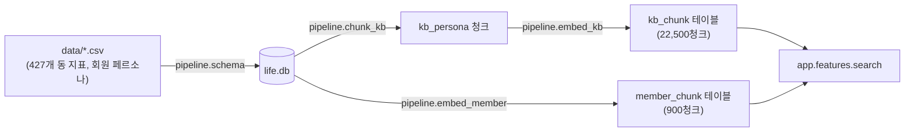
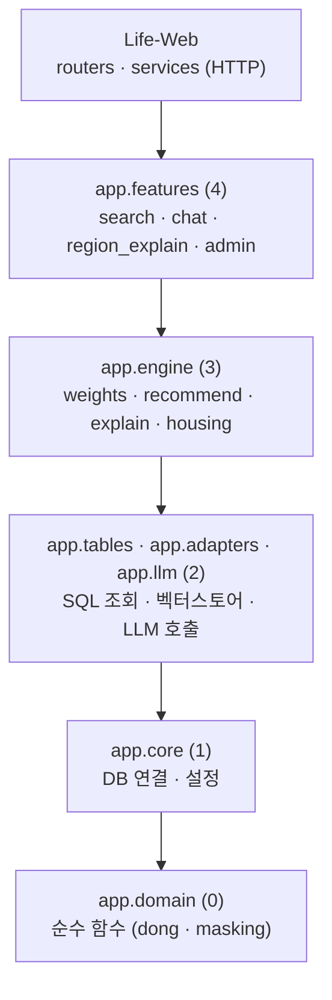

# 🏬 LIFE,FIT

<br/>


<br/>

서울 427개 행정동 중 사용자의 **라이프스타일 선호도**에 맞는 동네 TOP 5를 추천하고,
LLM이 근거를 들어 설명해 주는 서비스입니다. "3인 가구 40대"처럼 인구통계로 나누는
기존 방식과 다르게, 검색어나 슬라이더로 받은 선호도로 동네를 고릅니다.

두 저장소가 **같은 상위 폴더에 나란히** 있어야 동작합니다 — `Life-Web`이
`../Life-Embed-jh`를 `sys.path`로 직접 import합니다(pip 설치 아님).

| 저장소 | 역할 |
|---|---|
| [Life-Embed-jh](https://github.com/Life-fit-pj/Life-Embed-jh) | 추천 엔진 — SQLite, 임베딩, Claude 호출, 가중치/랭킹 파이프라인 |
| [Life-Web](https://github.com/Life-fit-pj/Life-Web) | FastAPI 서버 + 정적 프론트엔드 (UI/HTTP 레이어만) |

## 스택

| 영역 | 사용 |
|---|---|
| 웹 서버 | FastAPI, Uvicorn |
| 벡터 검색 | SQLite (`BLOB`, float32 raw bytes) + numpy 코사인 유사도, sentence-transformers 로컬 임베딩 |
| LLM 연동 | LangChain (`langchain-anthropic`) — 설명문 생성은 `claude-haiku-4-5`, 임베딩은 `intfloat/multilingual-e5-small`(384차원) |
| 지도 | 카카오맵 JS SDK |
| 프론트엔드 | 빌드 단계 없는 바닐라 JS (ES 모듈) |
| 인증 | 관리자 페이지는 Bearer 토큰, 회원 로그인은 미구현 |

## 동작 흐름

검색어 하나가 추천 카드로 나오기까지 (`Life-Web` → `Life-Embed-jh`):


지도 핀을 클릭하거나 결과에 후속 질문을 하면 `region_explain` / `chat`이 따로 응답합니다
(3~5초 걸려서 즉시 나오는 시설 정보와 분리돼 있습니다).

데이터는 오프라인 파이프라인이 미리 CSV를 SQLite·벡터로 바꿔 두고, 서비스는 그 결과만 읽습니다.



## 계층

`Life-Embed-jh/app/`은 6개 층으로 나뉘고 의존 방향은 한쪽으로만 흐릅니다
(`tests/test_layers.py`가 import 문을 AST로 훑어 이 방향을 강제합니다).
`Life-Web`은 이 엔진을 창구(`features`) 층에서만 불러옵니다 — 아는 파일은
`services/engine.py` 하나뿐입니다.



아래층은 위층을 부르지 않습니다. SQL은 `app.tables`에만 있고 `features`·`engine`은
표 이름조차 모릅니다 — 표가 바뀔 때 고칠 폴더를 한 곳으로 모으기 위해서입니다.

## 문서

| 파일 | 내용 |
|---|---|
| [Life-Embed-jh/README.md](https://github.com/Life-fit-pj/Life-Embed-jh/blob/main/README.md) | 엔진 설치·실행·폴더 구조 |
| [Life-Embed-jh/AGENTS.md](https://github.com/Life-fit-pj/Life-Embed-jh/blob/main/AGENTS.md) | 엔진 아키텍처·도메인 규칙 |
| [Life-Web/README.md](https://github.com/Life-fit-pj/Life-Web/blob/main/README.md) | 웹 설치·실행·API·다른 엔진 붙이기 |
| [Life-Web/AGENTS.md](https://github.com/Life-fit-pj/Life-Web/blob/main/AGENTS.md) | 웹 아키텍처·API 계약 |

## 실행

두 저장소를 나란히 두고, 웹만 띄우면 됩니다(엔진은 웹이 import).

```bash
cd Life-Web
py -m pip install fastapi uvicorn pydantic pandas numpy
py -m uvicorn main:app --reload --port 5000
```

`Life-Embed-jh/.env`(`ANTHROPIC_API_KEY`)와 `Life-Embed-jh/data/life.db`(~227MB, git LFS)가
먼저 있어야 합니다 — 얻는 방법은 [Life-Embed-jh/README.md](https://github.com/Life-fit-pj/Life-Embed-jh/blob/main/README.md) 참고.
